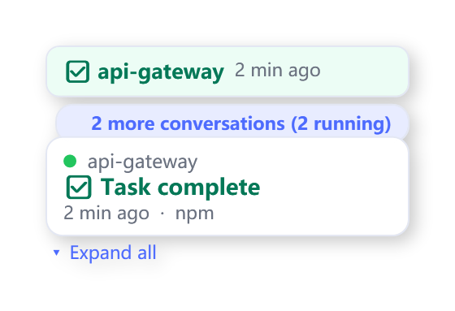
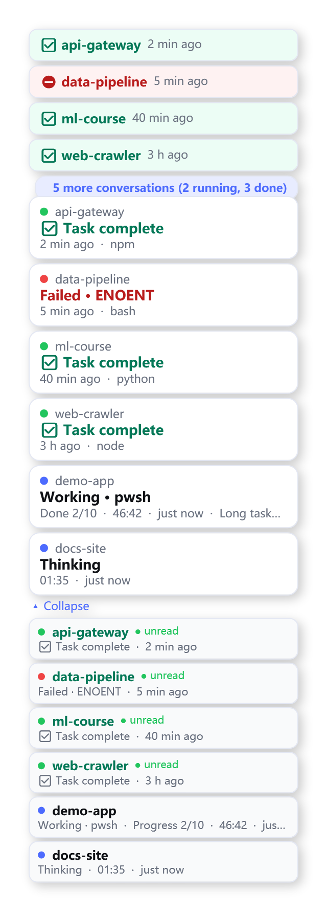
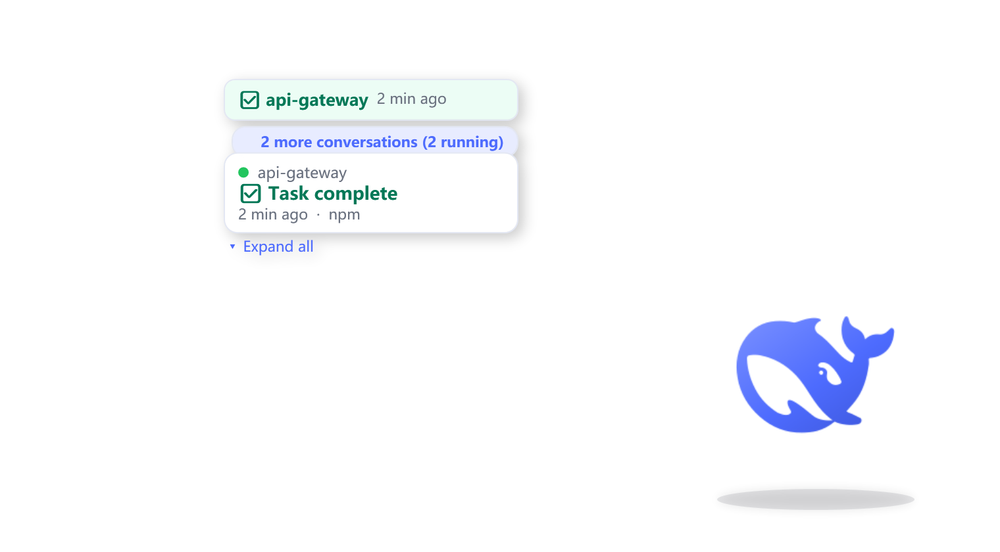

# Blue Whale Pet · 蓝鲸小深

**English** | [简体中文](README.zh-CN.md)

A desktop companion for DeepSeek Harness: an always-on-top whale that shows the real state of every Harness session without opening the main window.

Windows-only. Zero npm dependencies. No admin rights. Bilingual interface (简体中文 / English), switchable at runtime.


*The nine sprite rows, drawn from the official DeepSeek whale mark: idle · thinking · working · waiting · celebrate · error · drag · long task · (reserve). Only the whale is drawn — no props.*

---

## What it does

| | |
|---|---|
| **Drag anywhere** | Left-drag moves the pet; a flick glides and settles, a gentle placement gives one soft bounce. |
| **Edges are fixtures, not hiding places** | Drag past any screen edge and the pet is pinned flush to it, full size and fully visible, then slides along it. This is the deliberate opposite of pets that tuck themselves away at an edge. |
| **Live status bubbles** | One dialog box per conversation, in rank order. A running task shows its stage, tool, progress and a ticking elapsed time; a finished one keeps its box with a ticking age. |
| **Parallel tasks get parallel boxes** | Only the top-ranked box shows by default; *Expand* shows every task's own box. The badge reads "5 more conversations (1 running, 4 done)" rather than a bare, ambiguous `+5`. |
| **Boxes persist until clicked** | A finished task keeps its box — retention is by acknowledgement, not a timer. Clicking a box opens that conversation and removes just that box; a new reply brings its box back. |
| **Full conversation list** | *Expand* lists every conversation running now or finished and not yet clicked, with status badge, progress and freshness. |
| **Click the pet** | Brings DeepSeek Harness to the front (raises the open window, else launches it). |
| **Right-click menu** | Open Harness · expand list · scale 50–200 % · **language 中文/English** · silent mode · always-on-top · quit. Ctrl+wheel also scales. |
| **Remembers where it was** | Position and language are persisted; a resolution or taskbar change re-clamps the position into the same relative spot. |

## Screenshots

Rendered from the real WPF shell fed by the real reducer with synthetic sessions — no live desktop, no personal data (regenerate with `tools/Capture-DocsShots.ps1`).

| Status bubble | Expanded conversation list |
|---|---|
|  |  |

*Left: an unread completion keeps its box with a ticking age, the badge names the rest ("2 more conversations (2 running)"), and nothing is lost by staying collapsed. Right: expanding shows every surfaced conversation as its own box — running work with live progress and a long-task flag, finished work waiting to be acknowledged, a failure with its error code — plus the full list below.*

| The pet and its bubble |
|---|
|  |

---

## Interface language — 中文 / English

The pet is bilingual end to end, and you can switch at any time:

> **Right-click the pet → 语言 / Language → 中文 or English**

* The choice is **persisted** in `state/shell-config.json` and survives restarts.
* It changes **everything**: menus, badges, the expanded list, bubble labels, relative ages ("刚刚 / 3 分钟前" ↔ "just now / 3 min ago"), progress text and notification rows.
* A fresh installation follows the **OS UI culture** (Chinese systems start in Chinese, everything else in English) unless config or `-Language` says otherwise. The shell also accepts `-Language en` / `-Language zh-CN` on the command line, and the bridge accepts `--lang`.
* The switch needs no restart: the shell writes its language into the existing control file (`state/pet-control.json`), the bridge reads it on its next one-second poll and regenerates the snapshot in that language, and the popup rebuilds.

Implementation, for contributors:

* `src/core/i18n.mjs` — the catalogue for everything the **data** side renders (status labels, ages, progress, notification labels), plus `normalizeLanguage`/`t`/`formatAge`. Pure functions, fully unit-tested.
* `src/shell/PetStrings.ps1` — the same keys for everything the **WPF shell** renders (menus, badge sentences, hover line), reached through a `T '<key>'` helper. The file must stay UTF-8 **with BOM** (PowerShell 5.1 requirement; `tools/Validate-Shell.ps1 -Fix` repairs it).
* The two tables are keyed identically; `tests/i18n.test.mjs` asserts the key sets match and that every label branch renders in both languages.

---

## Running it

Requirements: Windows 10/11, Windows PowerShell 5.1 (built in), Node.js ≥ 18. No `npm install` — the bridge uses only Node built-ins.

```bat
scripts\start-pet.cmd
```

Starts the bridge and the shell, both hidden. Right-click the pet → *Quit pet* to stop.

### Starting automatically while Harness is open

`start-pet.cmd` is manual. To never think about it again, install the watchdog:

```powershell
powershell -NoProfile -ExecutionPolicy Bypass -File tools\Install-Autostart.ps1
```

That places a hidden launcher in the Startup folder and starts it immediately. From then on:

* **DeepSeek Harness opens** → the pet appears by itself;
* **DeepSeek Harness closes** → the pet puts itself away;
* nothing to run, no terminal, and it survives reboots.

```powershell
# check state
powershell -NoProfile -ExecutionPolicy Bypass -File tools\Install-Autostart.ps1 -Status

# undo (also stops a running watchdog immediately)
powershell -NoProfile -ExecutionPolicy Bypass -File tools\Install-Autostart.ps1 -Remove
```

Reinstall after **moving the project**, because the launcher stores the project path.

**Run the pet from a normal terminal.** When the pet is started from *inside* a restricted sandbox host, everything works — the status feed, the bubble, dragging, edge fixing, launch-if-not-running — except "raise an existing Harness window", which the sandbox forbids (cross-process window control is denied). The watchdog-spawned pet is outside any restricted host, which is why its click-to-raise always works.

---

## Architecture

```
   $DSH_HOME/sessions/…/session.v4.jsonl.zstd      $DSH_HOME/storages/session_projcache/…
   (append-only session event log, zstd frames)    (host's persisted Session Projection rows)
                    │                                          │
                    └──────────────┬───────────────────────────┘
                                   ▼
                        src/bridge.mjs  (Node, no dependencies)
                  tail each log by byte offset → fold events into
                  privacy-bounded facts → PetReducer → atomic snapshot
                                   │
                     state/pet-state.json  +  state/pet-control.json
                                   ▼
                   src/shell/WhalePet.ps1  (WPF, transparent windows)
                   120×130 pet window  +  status/panel popup window
```

Three parts, one direction of data:

1. **`src/core/*.mjs` — the pure core.** Event folding, the reducer, window geometry, the i18n catalogue. No I/O, no clock, no globals: every behaviour worth trusting is a pure function with a unit test.
2. **`src/bridge.mjs` — the only process that reads the Harness store.** It tails the real session logs, folds them into the small fact set the pet is allowed to know, runs the reducer, and publishes one JSON snapshot atomically. It also reads the shell's control file (hover, drag, acknowledgements, UI language).
3. **`src/shell/WhalePet.ps1` — the presentation.** Two transparent WPF windows (the pet, and a popup that grows from a status bubble into the conversation list). It never reads the Harness store; it renders the snapshot.

The seam matters: the privacy rules live in exactly one auditable file (`src/core/session-facts.mjs` plus `session-snapshot.mjs`), and the renderer can be replaced without touching the data path.

### Why the state comes from files, not HTTP

Harness exposes a loopback HTTP API, but it authenticates with a **per-process random launch token** exchanged at `GET /?token=…` for a signed, authority-bound cookie. A separate process cannot obtain that token, so the pet uses the two sources the Host itself uses and persists:

* the **session event log** — the authoritative `session/event` stream, written as a concatenation of independent zstd frames, which is what makes tailing by byte offset cheap and stream-like;
* the **Session Projection cache** — the Host's own persisted projection rows, the only place open *user questions* and *todo progress* appear.

The brief called for "SSE with automatic reconnect and polling fallback". The transport here is a byte-offset tail subscription rather than a socket: each poll decodes only the frames appended since the last one, a partially written trailing frame is simply left for the next poll, and a failed poll keeps serving the last good snapshot while marking itself degraded. There is no socket to drop.

### Privacy boundary

`src/core/session-facts.mjs` reads event payloads only to *recognise* them. What survives the fold is exactly: status, turn/step numbers, tool **names**, timestamps, todo counts, and a short machine error code (`EPERM`, `ENOENT`, `HTTP500`) extracted with a bounded regex. Prompts, model replies, tool arguments, tool result content, workspace paths and file contents are dropped.

Two deliberate choices:

* Only the **final segment** of the working directory is kept, as the project label.
* Session **titles are opt-in** (`--expose-title`). They are short, but they are derived from your prompts, so the pet shows the project folder unless you ask for more. `titleInput` — which embeds the first prompt verbatim — is never read.

`tests/reducer.test.mjs` asserts this: it folds an event carrying a secret and checks the secret is absent from the resulting facts.

### Clicking the pet: what happens, and what cannot

Clicking the pet or a bubble brings the **DeepSeek Harness desktop application** to the front. It cannot open *one specific conversation* — that is a limitation of Harness, not of the pet. The desktop app is raised by launching its executable: Electron holds a single-instance lock and focuses its own primary window on a second launch, so this needs no foreground rights; a real click also grants them, so a direct `SetForegroundWindow` succeeds. A browser tab is only a last resort when no desktop installation exists (identified strictly by the whale favicon — port probes that accept any `viewBox` once matched a local OpenCode install and opened the wrong app).

Harness has no deep link into a session: no URL routing, no `dsh://session/...`, no CLI, no host API that makes a session *current*, and Chromium exposes no accessibility tree by default (the full evidence table is in the Chinese README and the commit history). Clicking a bubble still **acknowledges that session** — that is what dismisses the bubble and the green dot. If per-conversation focus is ever wanted, the clean route is a Harness-side addition (`dsh://session/<id>`); the pet already carries the session id it would need.

---

## Sprite sheet

`assets/whale-sheet.png` is 8 columns × 9 rows of 192×208 cells, generated by `tools/build-sprites.mjs`:

| Row | State | Animation | Trigger |
|---|---|---|---|
| 0 | `idle` | gentle breathing, slow tail sway | every session idle |
| 1 | `thinking` | slow cruise, three staggered droplets | turn open, no tool running |
| 2 | `working` | slight body roll | a tool call is in flight |
| 3 | `waiting` | puzzled head-tilt with a question mark | approval or question pending |
| 4 | `celebrate` | leap, flip, land | turn completed |
| 5 | `error` | dive-away, fading | failure |
| 6 | `drag` | lifted, swaying with cursor direction | being dragged |
| 7 | `longtask` | heavier, slower rocking | busy more than 10 minutes |
| 8 | (reserve) | — | keeps the 8×9 contract |

The whale is the **official DeepSeek mark**, not a redrawn lookalike: every frame places the same 50×50 path under an affine transform, fitted to the box that state asks for, with the interior detail cut out through the even-odd fill rule. Brand blue `#4D6BFE`. Individual per-state previews live in [`docs/images/states/`](docs/images/states). The source path came from Harness's own web bundle (`dsh-web-frontend/dist/favicon.svg`); `tools/extract-whale.mjs` extracts it, and `art/whale.json` stores the result.

Rebuild the artwork (only needed if you change the builder):

```powershell
$env:NODE_PATH = "$env:USERPROFILE\.dsh\profiles\node_modules"   # for sharp
node tools\build-sprites.mjs
```

---

## Testing

```powershell
node tests\run-tests.mjs
```

96 unit tests across 7 files cover the geometry contract (edge fixing, seams, inertia, popup placement), the reducer (priority, timing, retention, acknowledgement shape), the privacy boundary, the completion store, the shell↔bridge control channel, and the bilingual catalogue (`tests/i18n.test.mjs` asserts both languages define the same keys and that every label branch renders in each).

The files are plain `node:test` modules, so `node --test tests/` works too outside a sandbox; `tests/run-tests.mjs` exists because `node --test` spawns child processes, which the DSH sandbox denies.

Live desktop checks (need the pet running):

```powershell
powershell -NoProfile -File tools\Test-PetEdges.ps1        # edge fixing against the real window
powershell -NoProfile -ExecutionPolicy Bypass -File tools\Test-BubbleRendering.ps1
```

Keep the shell scripts valid after editing any `.ps1`:

```powershell
powershell -NoProfile -ExecutionPolicy Bypass -File tools\Validate-Shell.ps1
```

---

## Repository map

| Path | Role |
|---|---|
| `src/core/pet-reducer.mjs` | `reducePet` / `deriveSession` / `moodOf` / `priorityOf` — the pure state machine |
| `src/core/geometry.mjs` | Edge fixing, seams, inertia, popup placement, persistence (reference implementation) |
| `src/core/i18n.mjs` | **Bilingual catalogue** for the data side; `normalizeLanguage`, `t`, `formatAge` |
| `src/core/session-facts.mjs` | **The privacy boundary**: event → bounded facts |
| `src/core/session-log.mjs` | Incremental zstd-frame log reader |
| `src/core/projection-cache.mjs` | Session Projection row reader (questions, todos) |
| `src/core/session-snapshot.mjs` | Watched session → reducer facts (localised fallback label) |
| `src/core/session-watcher.mjs` | Per-session tail bookkeeping + completion detection |
| `src/core/completions.mjs` | Completion retention policy (acknowledgement-driven) |
| `src/core/clock.mjs` | Duration formatting, harness-clock skew |
| `src/bridge.mjs` | Poller and snapshot publisher; reads the control file (incl. language) |
| `src/shell/WhalePet.ps1` | WPF shell: windows, animation, drag, bubble, panel, **language menu** |
| `src/shell/PetStrings.ps1` | **Bilingual catalogue** for the shell side (UTF-8 with BOM) |
| `src/shell/PetGeometry.ps1` | The same geometry in PowerShell, used by the shell |
| `scripts/start-pet.cmd` | Manual start (must stay CRLF + ASCII-only) |
| `scripts/Enable-PetAutostart.cmd` | One double-click: install autostart + start the recorder |
| `tools/Install-Autostart.ps1` | Installs / removes / reports the Startup launcher |
| `tools/Watch-Pet.ps1` + `Watch-Pet.vbs` | The watchdog loop and its hidden launcher |
| `tools/build-sprites.mjs` | Rebuilds `assets/whale-sheet.png` from `art/whale.json` |
| `tools/Capture-DocsShots.ps1` | Regenerates the documentation screenshots (real renderer, synthetic data) |
| `tools/Test-*.ps1`, `Probe-*.ps1` | Live verification tooling (edges, hit-testing, watchdog, raising…) |
| `tests/` | 96 unit tests, runner included (`run-tests.mjs`) |
| `docs/images/` | Screenshots used by both READMEs |
| `art/whale.json` | The extracted official whale path |

---

## Maintainer notes (the traps that cost real time)

* **Restart the bridge after editing anything in `src/core/`.** Node caches modules in memory; a bridge left running serves OLD code and has caused several phantom "the fix does nothing" hunts.
* **A policy tested only through the reducer can still be broken in the bridge.** Retention policy lives in `src/core/completions.mjs` as pure functions with their own tests; when a behaviour spans two modules, test the module that owns the decision.
* **PowerShell 5.1 reads BOM-less scripts as ANSI.** Chinese literals turn to mojibake and the parser reports "unexpected token". Run `tools/Validate-Shell.ps1 -Fix` after editing any `.ps1`. It also rejects assignments to reserved automatic variables (`$host`, `$error`, …).
* **`scripts/start-pet.cmd` must keep CRLF line endings and stay ASCII-only** — both are hard `cmd.exe` requirements; bare LF fragments the script and multibyte characters break it.
* **A WPF `AllowsTransparency` window is hit-tested per pixel by alpha.** The pet's background is therefore alpha-1 black (`#01000000`): invisible to the eye, opaque to the hit test, so the whole pet is draggable. With `Brushes.Transparent` only the whale's own pixels were clickable. Likewise, a **null** `Background` is not hit-testable — clickable panels set `Brushes.Transparent` explicitly.
* **The drag is polled from the tick, not driven by mouse events.** The window is shown without activation, so `MouseMove`/`MouseUp` are unreliable; movement and release are read from the OS each frame (`Cursor.Position`, `GetAsyncKeyState`). `[System.Windows.Forms.Control]::MouseButtons` must NOT be used — in a pure WPF process it reports `None` continuously.
* **Every clickable thing in the popup needs a `Tag`.** Clicks are resolved by hit-testing the visual tree and reading the matched element's `Tag`; a control without one is invisible to the click path even when its `Add_Click` is correct.
* **`@($list)` throws under `Set-StrictMode -Version Latest`** when `$list` is a `List[object]` — assign the list directly instead. A single such expression once made every control-file write fail silently.
* **The shell reads the view model under strict mode, so a missing property is fatal.** `tests/reducer.test.mjs` pins the complete field list for every branch that can produce a bubble, notification, hover block or list entry.
* **WPF sizes windows in DIP; the pet reasons in physical pixels.** `Move-WindowExact` asserts the physical rectangle with `SetWindowPos` and folds in the observed delta rather than trusting the DIP conversion.
* **`node --test` cannot run inside the DSH sandbox** (child-process spawn is denied). Use `node tests/run-tests.mjs`.
* **`Start-Process` fails on some machines when output is redirected** (case-duplicate proxy env vars build a case-insensitive dictionary and throw). Use `cmd /c "... > log.txt"` to capture a spawned shell's output.
* **The watchdog clears `state/pet-quit` only after its own stop step, and the marker expires (12 h)** — otherwise a deliberate quit is immediately undone, or a crash becomes a permanent lockout. The launch latch (`state/pet-launching`, 45 s) plus a 30 s verification window prevent the "two whales" cold-start race.

---

## Contributing

Issues and PRs are welcome — see [CONTRIBUTING.md](CONTRIBUTING.md). The project is intentionally dependency-free; please keep it that way. UI strings belong in the two catalogues (`src/core/i18n.mjs`, `src/shell/PetStrings.ps1`), never inline.

## License

[MIT](LICENSE) © 2026 Sun Haiming (孙海铭)
