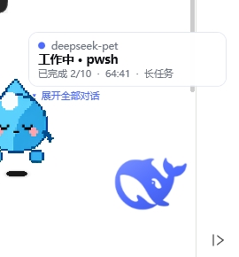
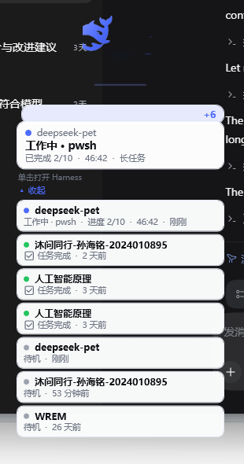
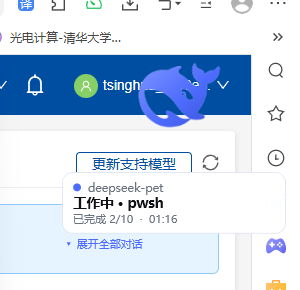

# 蓝鲸小深 · Blue Whale Pet

[English](README.md) | **简体中文**

DeepSeek Harness 的桌面伙伴：一只置顶的小蓝鲸，不打开主窗口就能看到每个 Harness 会话的真实状态。

仅支持 Windows。零 npm 依赖。无需管理员权限。界面双语（简体中文 / English），可随时切换。


*九行精灵帧，取自 DeepSeek 官方鲸鱼标识：待机 · 思考中 · 工作中 · 等待确认 · 完成庆祝 · 出错 · 拖拽中 · 长任务 ·（保留行）。只画鲸鱼本身，不加任何道具。*

---

## 功能一览

| | |
|---|---|
| **任意拖拽** | 左键拖动；用力一甩会滑行减速，轻轻放下有一次柔和的弹跳。 |
| **边缘是支点，不是藏身之处** | 拖过屏幕任意边缘，桌宠会被完整地贴合固定在该边缘上（完整尺寸、完全可见），并可沿边滑动。这与把桌宠"藏"进边缘的做法刻意相反。 |
| **实时状态气泡** | 每个对话一个对话框，按优先级排序。进行中的任务显示阶段、工具、进度和跳动的计时；已完成的保留气泡并持续更新"多久之前"。 |
| **并行任务并行气泡** | 默认只显示最高优先级的气泡，保证一眼可读；点"展开"可看到每个任务自己的气泡。角标写明"另有 5 个对话（1 个进行中，4 个已完成）"，而不是含义模糊的裸 `+5`。 |
| **气泡保留到点击为止** | 已完成的任务保留气泡——保留由"确认"驱动，而不是定时器，不会漏掉任何一次完成。点击气泡（或桌宠）打开对应对话并只消除那一个气泡；同一对话有新回复时气泡会再次出现。 |
| **完整对话列表** | "展开"列出所有正在进行、或已完成但尚未点击的对话，带状态角标（绿=完成 / 蓝=进行 / 黄=等待 / 红=出错）、进度、运行时长和新鲜度。 |
| **点击桌宠** | 把 DeepSeek Harness 桌面应用调到前台（有窗口就唤起，没有就启动）。 |
| **右键菜单** | 打开 Harness · 展开对话列表 · 缩放 50–200% · **语言 中文/English** · 静默模式 · 始终置顶 · 退出。Ctrl+滚轮也可缩放。 |
| **记住位置** | 位置和语言都会持久化；分辨率或任务栏变化后会按相对位置重新钳制回屏幕内。 |

## 截图

| 状态气泡 | 展开的对话列表 |
|---|---|
|  |  |

*气泡显示阶段、工具、todo 进度、跳动计时和长任务标记；展开列表显示每个对话的独立状态，`+6` 角标统计其余对话。*

| 桌面实景 |
|---|
|  |

---

## 界面语言 —— 中文 / English

桌宠从数据到界面都是双语的，随时可切换：

> **右键桌宠 → 语言 / Language → 中文 或 English**

* 选择会**持久化**到 `state/shell-config.json`，重启后依然生效。
* 切换影响**一切**：菜单、角标、对话列表、气泡标签、相对时间（"刚刚 / 3 分钟前" ↔ "just now / 3 min ago"）、进度文案和通知行。
* 全新安装时跟随**系统 UI 语言**（中文系统默认中文，其余默认英文）；也可用命令行参数 `-Language en` / `-Language zh-CN`（shell）或 `--lang`（bridge）指定。
* 切换无需重启：shell 把语言写进既有的控制文件（`state/pet-control.json`），bridge 在下一次轮询（约 1 秒）读到后按该语言重新生成快照，弹出层随即重建。

面向贡献者的实现说明：

* `src/core/i18n.mjs` —— **数据侧**所有文案（状态标签、相对时间、进度、通知标签）的词典，附带 `normalizeLanguage` / `t` / `formatAge`。纯函数，全部有单元测试。
* `src/shell/PetStrings.ps1` —— **WPF 界面侧**（菜单、角标句子、悬停行）的同键词典，通过 `T '<key>'` 取用。该文件必须保持 UTF-8 **带 BOM**（PowerShell 5.1 的硬性要求；`tools/Validate-Shell.ps1 -Fix` 可自动修复）。
* 两张表按键对齐；`tests/i18n.test.mjs` 断言两种语言键集一致、每个标签分支在两种语言下都能渲染。

---

## 运行

环境要求：Windows 10/11、Windows PowerShell 5.1（系统自带）、Node.js ≥ 18。无需 `npm install`——bridge 只用 Node 内置模块。

```bat
scripts\start-pet.cmd
```

启动 bridge 和 shell（均在后台隐藏运行）。右键桌宠 → 退出桌宠 即可停止。

### 随 Harness 自动启停

`start-pet.cmd` 是手动启动。想一劳永逸，安装看门狗：

```powershell
powershell -NoProfile -ExecutionPolicy Bypass -File tools\Install-Autostart.ps1
```

它会在"启动"文件夹放置一个隐藏启动器并立即生效。之后：

* **DeepSeek Harness 打开** → 桌宠自己出现；
* **DeepSeek Harness 关闭** → 桌宠自己收起；
* 无需终端、无需手动操作，重启后依然有效。

```powershell
# 查看状态
powershell -NoProfile -ExecutionPolicy Bypass -File tools\Install-Autostart.ps1 -Status

# 卸载（同时立即停止正在运行的看门狗）
powershell -NoProfile -ExecutionPolicy Bypass -File tools\Install-Autostart.ps1 -Remove
```

**移动项目目录后需要重装**，因为启动器里存的是项目路径。

**请从普通终端运行桌宠。** 从受限沙箱宿主内部启动时，其余一切正常（状态流、气泡、拖拽、贴边、自动拉起），唯独"唤起已存在的 Harness 窗口"会被环境拒绝（禁止跨进程控制窗口）。看门狗拉起的桌宠在任何受限宿主之外，所以它的点击唤起总是有效。

---

## 架构

```
   $DSH_HOME/sessions/…/session.v4.jsonl.zstd      $DSH_HOME/storages/session_projcache/…
   （只追加的会话事件日志，zstd 帧）                （宿主持久化的 Session Projection 行）
                    │                                          │
                    └──────────────┬───────────────────────────┘
                                   ▼
                        src/bridge.mjs  （Node，零依赖）
                  按字节偏移量尾读日志 → 折叠为隐私受限事实
                  → PetReducer → 原子发布快照
                                   │
                     state/pet-state.json  +  state/pet-control.json
                                   ▼
                   src/shell/WhalePet.ps1 （WPF，透明窗口）
                   120×130 桌宠窗口  +  状态/面板弹出窗口
```

三个部件，单向数据流：

1. **`src/core/*.mjs` —— 纯核心。** 事件折叠、状态机、窗口几何、双语词典。无 I/O、无时钟、无全局状态：每个值得信赖的行为都是一个带单元测试的纯函数。
2. **`src/bridge.mjs` —— 唯一读取 Harness 存储的进程。** 按字节偏移尾读真实会话日志，折叠为桌宠被允许知道的最小事实集，运行 reducer，原子发布一份 JSON 快照；同时读取 shell 的控制文件（悬停、拖拽、确认、界面语言）。
3. **`src/shell/WhalePet.ps1` —— 呈现层。** 两个透明 WPF 窗口（桌宠本体，以及从状态气泡长成对话列表的弹出层）。它从不读取 Harness 存储，只渲染快照。

这条接缝很重要：隐私规则集中在唯一一处可审计的文件里（`src/core/session-facts.mjs` 与 `session-snapshot.mjs`），渲染层可以整体替换而不触碰数据链路。

### 为什么走文件而不是 HTTP

Harness 提供回环 HTTP API，但认证靠**每次启动随机生成的 launch token**（在 `GET /?token=…` 处换取签名且绑定授权方的 cookie）。独立进程拿不到这个 token，所以桌宠改用宿主自己也在使用并持久化的两个数据源：

* **会话事件日志** —— 权威的 `session/event` 流，以独立 zstd 帧拼接写盘，因此按字节偏移尾读既廉价又像流；
* **Session Projection 缓存** —— 宿主自己持久化的投影行，是唯一能看到未回答的**用户提问**和 **todo 进度**的地方。

需求书写的是"SSE + 自动重连 + 轮询兜底"。这里的传输是按字节偏移的尾读订阅而非套接字：每次轮询只解码自上次以来追加的帧，写了一半的末尾帧留给下次轮询，轮询失败则继续供应上一份完好好快照并把自身标记为降级。没有套接字，也就没有套接字可断。

### 隐私边界

`src/core/session-facts.mjs` 读取事件载荷只是为了**识别**它们。折叠后存活下来的只有：状态、turn/step 编号、工具**名**、时间戳、todo 计数，以及用有界正则提取的短机器错误码（`EPERM`、`ENOENT`、`HTTP500`）。提示词、模型回复、工具参数、工具结果内容、工作区路径、文件内容一律丢弃。

两个刻意的设计：

* 工作目录只保留**最后一段**作为项目标签。
* 会话**标题是可选的**（`--expose-title`）。标题虽短，但派生自你的提示词，所以默认只显示项目文件夹；`titleInput`（逐字嵌入首条提示词）从不读取。

`tests/reducer.test.mjs` 对此有断言：折叠一个携带机密的事件，然后检查机密没有出现在结果事实中。

### 点击桌宠会发生什么、什么做不到

点击桌宠或气泡会把 **DeepSeek Harness 桌面应用**调到前台，但无法打开"某一个具体对话"——这是 Harness 的限制，不是桌宠的。桌面应用通过再次启动其可执行文件来唤起：Electron 持有单实例锁，二次启动会聚焦自己的主窗口，因此不需要前台权限；真实点击本身也会授予前台权限，直接 `SetForegroundWindow` 因此成功。只有当桌面版未安装时才退而求其次打开浏览器标签（用鲸鱼 favicon 严格识别——曾有一个版本接受任何含 `viewBox` 的端口探测，结果匹配到本地 OpenCode 实例、打开了错误的应用）。

Harness 没有进入某个会话的深链：URL 不参与路由、没有 `dsh://session/...`、CLI 不提供、宿主 API 也没有"把某会话置为当前"的能力，Chromium 默认也不暴露可访问性树（完整证据表见项目早期版本的 README 与提交历史）。不过点击气泡仍会**确认该会话**——这正是气泡和绿点消失的机制。如果将来要按会话聚焦，干净的做法是在 Harness 侧增加（例如 `dsh://session/<id>`）；桌宠已经携带所需的会话 id。

---

## 精灵图

`assets/whale-sheet.png` 为 8 列 × 9 行、每格 192×208，由 `tools/build-sprites.mjs` 生成：

| 行 | 状态 | 动画 | 触发 |
|---|---|---|---|
| 0 | `idle` | 轻微呼吸浮动，尾巴缓缓摆动 | 所有会话空闲 |
| 1 | `thinking` | 慢速巡游，头顶三颗错峰水滴 | turn 打开、无工具运行 |
| 2 | `working` | 身体微晃 | 有工具调用在执行 |
| 3 | `waiting` | 疑问姿态，歪头，头顶问号 | 有审批或提问待回应 |
| 4 | `celebrate` | 跃起、翻转、落回 | turn 完成 |
| 5 | `error` | 下潜告别，逐渐淡出 | 失败 |
| 6 | `drag` | 被拎起来，随光标方向摇摆 | 被拖拽 |
| 7 | `longtask` | 更沉、更慢的摇晃 | 忙碌超过 10 分钟 |
| 8 |（保留行）| — | 维持 8×9 契约 |

鲸鱼是 **DeepSeek 官方标识**，不是临摹：每一帧都在仿射变换下放置同一个 50×50 路径，按该状态需要的盒子拟合，内部细节用 even-odd 填充规则镂空。品牌蓝 `#4D6BFE`。各状态的单独预览图见 [`docs/images/states/`](docs/images/states)。路径来源是 Harness 自带的前端产物（`dsh-web-frontend/dist/favicon.svg`），由 `tools/extract-whale.mjs` 提取，结果存于 `art/whale.json`。

重建精灵图（仅当修改了构建脚本才需要）：

```powershell
$env:NODE_PATH = "$env:USERPROFILE\.dsh\profiles\node_modules"   # sharp 所在
node tools\build-sprites.mjs
```

---

## 测试

```powershell
node tests\run-tests.mjs
```

7 个文件共 **96 个单元测试**，覆盖几何契约（贴边、跨屏接缝、惯性、弹出层定位）、reducer（优先级、时序、保留策略、确认形状）、隐私边界、完成记录存储、shell↔bridge 控制通道，以及双语词典（`tests/i18n.test.mjs` 断言两种语言键集一致、每个标签分支在两种语言下都能渲染）。

测试文件就是普通的 `node:test` 模块，在沙箱外也可用 `node --test tests/` 运行；`tests/run-tests.mjs` 之所以存在，是因为 `node --test` 需要派生子进程，而 DSH 沙箱禁止这一操作。

实机桌面校验（需要桌宠正在运行）：

```powershell
powershell -NoProfile -File tools\Test-PetEdges.ps1        # 对真实窗口验证贴边
powershell -NoProfile -ExecutionPolicy Bypass -File tools\Test-BubbleRendering.ps1
```

修改任何 `.ps1` 后保持脚本可被 5.1 解析：

```powershell
powershell -NoProfile -ExecutionPolicy Bypass -File tools\Validate-Shell.ps1
```

---

## 仓库地图

| 路径 | 职责 |
|---|---|
| `src/core/pet-reducer.mjs` | `reducePet` / `deriveSession` / `moodOf` / `priorityOf` —— 纯状态机 |
| `src/core/geometry.mjs` | 贴边、跨屏接缝、惯性、弹出层定位、位置持久化（参考实现） |
| `src/core/i18n.mjs` | **数据侧双语词典**；`normalizeLanguage`、`t`、`formatAge` |
| `src/core/session-facts.mjs` | **隐私边界**：事件 → 受限事实 |
| `src/core/session-log.mjs` | 增量 zstd 帧日志读取器 |
| `src/core/projection-cache.mjs` | Session Projection 行读取器（提问、todo） |
| `src/core/session-snapshot.mjs` | 被监视会话 → reducer 事实（本地化的回退标签） |
| `src/core/session-watcher.mjs` | 每会话的尾读簿记 + 完成检测 |
| `src/core/completions.mjs` | 完成保留策略（由确认驱动） |
| `src/core/clock.mjs` | 时长格式化、宿主时钟偏差 |
| `src/bridge.mjs` | 轮询器与快照发布器；读取控制文件（含语言） |
| `src/shell/WhalePet.ps1` | WPF shell：窗口、动画、拖拽、气泡、面板、**语言菜单** |
| `src/shell/PetStrings.ps1` | **界面侧双语词典**（UTF-8 带 BOM） |
| `src/shell/PetGeometry.ps1` | 同一套几何的 PowerShell 实现，供 shell 使用 |
| `scripts/start-pet.cmd` | 手动启动（必须保持 CRLF + 纯 ASCII） |
| `scripts/Enable-PetAutostart.cmd` | 一次双击：安装自启 + 启动证据记录器 |
| `tools/Install-Autostart.ps1` | 安装 / 卸载 / 查询"启动"文件夹启动器 |
| `tools/Watch-Pet.ps1` + `Watch-Pet.vbs` | 看门狗循环及其隐藏启动器 |
| `tools/build-sprites.mjs` | 从 `art/whale.json` 重建 `assets/whale-sheet.png` |
| `tools/Test-*.ps1`、`Probe-*.ps1` | 实机校验工具（贴边、命中测试、看门狗、唤起……） |
| `tests/` | 96 个单元测试，含运行器（`run-tests.mjs`） |
| `docs/images/` | 两份 README 使用的截图 |
| `art/whale.json` | 提取出的官方鲸鱼路径 |

---

## 维护者笔记（那些真正耗时踩过的坑）

* **改了 `src/core/` 之后必须重启 bridge。** Node 在内存中缓存模块，一直运行的 bridge 持续供应旧代码产出的快照；这已经引发过数次"修复明明对了却没效果"的排查。
* **只通过 reducer 测试的策略仍可能在 bridge 里被破坏。** 保留策略放在 `src/core/completions.mjs`，作为带独立测试的纯函数；行为跨两个模块时，要测试**拥有决策权**的那个模块。
* **PowerShell 5.1 把无 BOM 脚本当 ANSI 读。** 中文字面量变乱码，解析器对看似正确的字符串报"unexpected token"。改完任何 `.ps1` 都跑一遍 `tools/Validate-Shell.ps1 -Fix`；它同时拒绝向保留自动变量（`$host`、`$error` 等）赋值。
* **`scripts/start-pet.cmd` 必须保持 CRLF 行尾且纯 ASCII** —— 这都是 `cmd.exe` 的硬性要求；裸 LF 会把脚本撕碎，多字节字符会使其解析错乱。
* **WPF `AllowsTransparency` 窗口按像素 alpha 做命中测试。** 桌宠背景因此是 alpha=1 的黑色（`#01000000`）：肉眼不可见，命中测试不透明，整只桌宠都可拖。若用 `Brushes.Transparent`，只有鲸鱼自身的不透明像素可点。同理，**null** 的 `Background` 不可命中——可点击面板要显式设置 `Brushes.Transparent`。
* **拖拽由 tick 轮询，而不是鼠标事件驱动。** 窗口以不激活方式显示，`MouseMove`/`MouseUp` 不可靠；移动与释放每帧从操作系统读取（`Cursor.Position`、`GetAsyncKeyState`）。绝不能用 `[System.Windows.Forms.Control]::MouseButtons`——纯 WPF 进程里它永远报 `None`。
* **弹出层里每个可点击元素都必须有 `Tag`。** 点击是通过命中测试可视树、读取命中元素的 `Tag` 来解析的；没有 `Tag` 的控件即使 `Add_Click` 写得再对也收不到点击。
* **`Set-StrictMode -Version Latest` 下对 `List[object]` 用 `@($list)` 会抛异常**——直接赋值该列表即可。曾有一个这样的表达式让控制文件的所有写入静默失败。
* **shell 在严格模式下读取视图模型，缺一个属性就是致命的。** `tests/reducer.test.mjs` 为每个可能产生气泡、通知、悬停块或列表行的分支钉住了完整字段清单。
* **WPF 用 DIP 定尺寸，桌宠按物理像素思考。** `Move-WindowExact` 用 `SetWindowPos` 断言物理矩形并把观测到的偏差折算回去，而不是信任 DIP 换算。
* **`node --test` 在 DSH 沙箱内跑不了**（禁止派生子进程）。用 `node tests/run-tests.mjs`。
* **部分机器上 `Start-Process` 在重定向输出时会失败**（大小写重复的代理环境变量构建大小写不敏感字典时抛异常）。要捕获子 shell 输出请用 `cmd /c "... > log.txt"`。
* **看门狗只在自己那步停止动作之后才清除 `state/pet-quit`，且该标记会过期（12 小时）**——否则主动退出会被立即撤销，或者一次崩溃变成永久锁定。启动闩（`state/pet-launching`，45 秒）加上 30 秒的启动验证窗口，共同防止了"双鲸"冷启动竞态。

---

## 参与贡献

欢迎 Issue 与 PR，见 [CONTRIBUTING.md](CONTRIBUTING.md)。本项目刻意保持零依赖，请继续维持。界面文案一律放进两张词典（`src/core/i18n.mjs`、`src/shell/PetStrings.ps1`），不要写死在代码里。

## 开源许可

[MIT](LICENSE) © 2026 孙海铭 (Sun Haiming)
